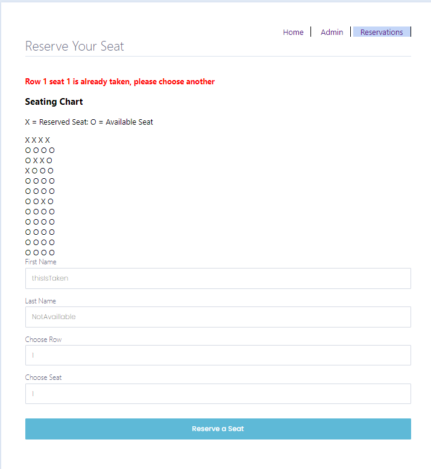

# Trip Reservation System - Web Application

**Description:** This project is worked on by Scrum Team 3 for IT 4320 - Software Engineering. It includes the use of Flask to host on the local machine's prefered browser. The different pages are outlined below....


---
## Page 1: Home ##


This is the first page that is presented to the user. The user can either pick on choice box of the admin login or to reserve and seat. The top has a navigation bar for the home, admin, and reservations.

---
## Page 2: Admin ##


This admin form has a field for a username and password that is supplied by the passcodes.txt. Once the user logs in, they will be able to see the current seating chart and the total amount of the seats declared by this cost matrix

```python
def get_cost_matrix():
    cost_matrix = [[100, 75, 50, 100] for row in range(12)]
    return cost_matrix
```


---
## Page 3: Reservations ##
This next page has the actual seating reservations. It included the fields of First Name, Last Name, Row, and Seat. The seating chart at the top displays the current seats that are either taken (declared with an 'X') or not taken (declared with an 'O')


If a user tries to select a seat that is already taken, an error message will display and the reservation is not added to the reservations.txt





If a user selects a seat that is open, a message with their ticket will display. This information will be written to the reservations.txt.


---

## A Full Walkthrough

Here is a full walkthrough of the functionality of the program.

